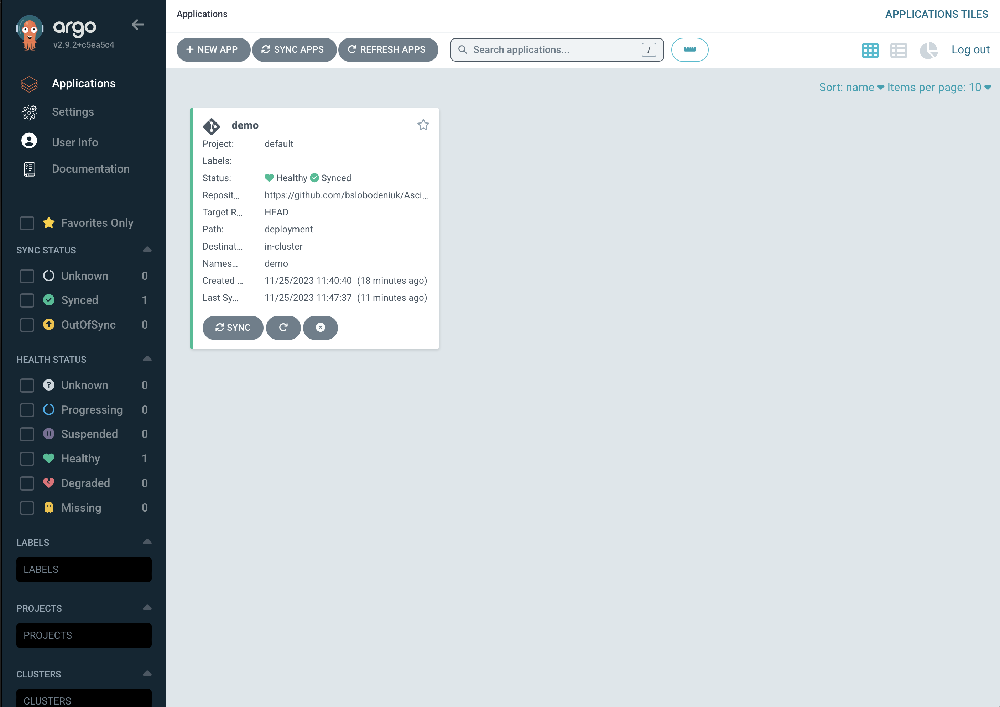

### use k3d to create a kubernetes cluster
```agsl
k3d cluster create argocd
```
### create namespace
```bash
k create ns argocd 
```
### install argocd
```bash
k apply -n argocd -f https://raw.githubusercontent.com/argoproj/argo-cd/stable/manifests/install.yaml 
```
### check argocd. wait until all pods are running
```bash
k get all -n argocd 
k get po -n argocd -w # wait until all pods are running
```
### port forward argocd server
```bash
k port-forward svc/argocd-server -n argocd 8080:443& 
```
### get argocd password
```bash
k get secret -n argocd argocd-initial-admin-secret -o jsonpath="{.data.password}" | base64 -d; echo 
```
### To login to ArgoCD GUI, use the following URL and credentials:
### URL: https://localhost:8080 username: admin password: "password from above"

### port forward echo server
```bash
k port-forward -n demo svc/echo-service 8088:8080& 
```
### test echo server
```bash
curl localhost:8088 
```

### delete argocd
```bash
k delete -n argocd -f https://raw.githubusercontent.com/argoproj/argo-cd/stable/manifests/install.yaml 
```
### delete cluster
```bash
k3d cluster delete argocd
```


